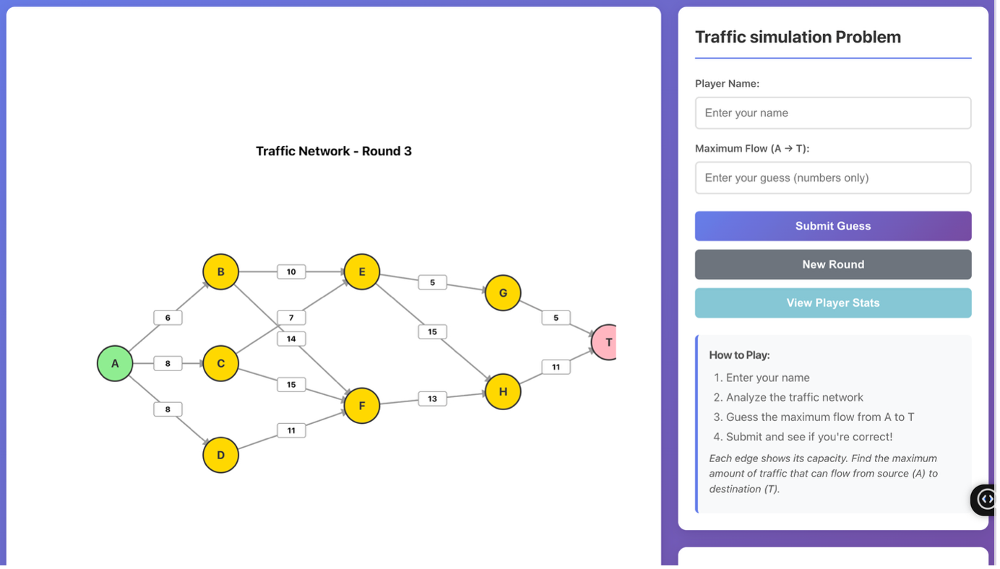

# 🚦 Traffic Simulation Game (Python)


> An interactive Python game that challenges players to **predict the maximum traffic flow**
> in a randomly generated network using **Edmonds–Karp and Dinic’s algorithms**.
> The project benchmarks algorithm performance and stores results in a normalized SQLite database.

---

## 🎮 Gameplay Preview


## 🚀 Demo


---

## 🧠 Project Overview

This project combines **algorithmic problem-solving**, **game-based learning**, and
**performance analysis** to help users understand **maximum flow algorithms** in a practical way.

Both algorithms are implemented **from scratch**, without using external graph libraries.

---

## ⚙️ Algorithms Implemented

### Edmonds–Karp Algorithm
- BFS-based augmenting path method
- Guaranteed polynomial time complexity
- Tracks flow on each edge

### Dinic’s Algorithm
- Constructs a level graph using BFS
- Uses DFS to push blocking flows
- Faster and more scalable than Edmonds–Karp

---

## ✨ Features

- Random-capacity directed traffic network (capacities 5–15)
- Player guesses the maximum flow from **A → T**
- Two independent max-flow algorithms
- Execution time recorded for each algorithm
- Results stored in a normalized SQLite database (3NF)
- Unit tests for correctness verification

---

## 🎯 Why This Project?

- Learn maximum flow algorithms intuitively
- Compare Edmonds–Karp vs Dinic performance
- Practice algorithm benchmarking
- Demonstrates clean database design
- Ideal for CS students and interview preparation

---

## 👨‍🎓 Who Is This For?

- Computer Science & Software Engineering students
- Algorithm and data-structure learners
- Python developers
- Game-based learning enthusiasts

---

## 🛠 How to Run

### 1️⃣ Create Virtual Environment & Install Dependencies
```bash
python3 -m venv venv
source venv/bin/activate
pip install -r requirements.txt

```

⭐ Support
If you find this project useful or interesting, please consider giving it a ⭐ on GitHub.
🔗 Repository
https://github.com/gamikapunsisi/Traffic_Simulation


